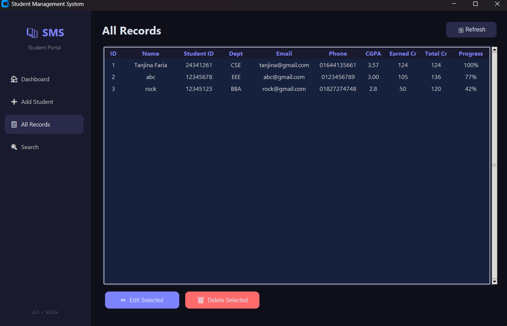

# 📚 Student Management System

A desktop application to manage university student records, built with Python and CustomTkinter.

## 🖥️ Screenshots


## ✨ Features
- Add, edit, and delete student records
- Track earned credits and total credits with a live progress bar
- Credit progress color changes (green / yellow / red) based on completion
- Dashboard with total students, department count, and live stats
- Department-wise bar chart on dashboard
- Search students by name, student ID, or department
- All Records table with progress percentage column
- SQLite database for persistent local storage
- Modern dark UI with sidebar navigation

## 🛠️ Tech Stack
| Technology | Purpose |
|---|---|
| Python 3 | Core language |
| CustomTkinter | Modern dark UI |
| SQLite | Local database |
| Tkinter ttk | Table / Treeview |

## 🚀 How to Run

**1. Install dependencies**
```bash
pip install customtkinter pillow
```

**2. Run the app**
```bash
python app.py
```

## 💡 Concepts Used
- Object-oriented programming with classes
- SQLite database with CRUD operations
- Event-driven GUI programming
- Dynamic UI updates and live progress tracking
- Data persistence with local file storage